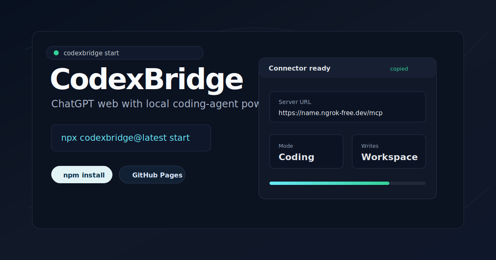

<p align="center">
  
</p>

<h1 align="center">CodexBridge</h1>

<p align="center">
  Let ChatGPT web see your Codex-style repo context and act like a local coding agent.
</p>

<p align="center">
  <a href="https://www.npmjs.com/package/codexbridge"></a>
  <a href="https://github.com/naplesblue/codexbridge/actions"></a>
  <a href="https://github.com/naplesblue/codexbridge/blob/main/LICENSE"></a>
  <a href="https://naplesblue.github.io/codexbridge/"></a>
</p>

<p align="center">
  <a href="https://naplesblue.github.io/codexbridge/">Website</a>
  ·
  <a href="README_ZH.md">中文 README</a>
  ·
  <a href="https://naplesblue.github.io/codexbridge/zh.html">中文网站</a>
  ·
  <a href="https://github.com/naplesblue/codexbridge">Star on GitHub</a>
  ·
  <a href="https://www.npmjs.com/package/codexbridge">npm</a>
  ·
  <a href="DOMAIN_SETUP.md">Stable URL guide</a>
  ·
  <a href="FAQ.md">FAQ</a>
  ·
  <a href="SECURITY.md">Security</a>
</p>

## Installation

CodexBridge requires Node.js 20+ and a ChatGPT Plus or Pro account with Apps / Developer Mode access.

Install the CLI:

```bash
npm install -g codexbridge
```

Then run setup inside the repo you want ChatGPT to work on:

```bash
cd /path/to/your/repo
codexbridge setup
```

CodexBridge copies the ChatGPT Server URL for you. In ChatGPT, open `Settings -> Apps -> Advanced settings -> Create app`, paste that URL, and choose `Authentication: No Authentication / None`.

After setup, daily use from the same repo is just:

```bash
codexbridge start
```

CodexBridge turns ChatGPT Developer Mode into a local coding agent for that folder. It gives ChatGPT bounded MCP tools for file reads, code search, exact edits, git inspection, safe verification commands, and explicit Codex-style context from `AGENTS.md`, `.ai-bridge`, git state, and selected source files.

CodexBridge is not a rate-limit bypass. It uses ChatGPT's official Developer Mode and MCP app path to connect your own ChatGPT session to your own local repo. ChatGPT and Codex remain separate product surfaces, each subject to its own plan limits, safety rules, and availability.

CodexBridge began as a fork of CodexPro and is now maintained as a localized, independent fork focused on ChatGPT fallback coding workflows.

## Quick Choices

| Need | Use |
| --- | --- |
| Fast first setup | `npm install -g codexbridge`, then `codexbridge setup` |
| Daily start | `codexbridge start` from the same repo |
| Stable ChatGPT URL | ngrok free dev domain or Cloudflare named tunnel |
| Smallest tool surface | default `CODEXBRIDGE_TOOL_MODE=standard` |
| Full diagnostics | `codexbridge start --tool-mode full` |
| No ChatGPT-triggered shell | `codexbridge start --no-bash` |
| Compact chat transcript | default bash cards; use `--bash-transcript full` only when needed |
| Local Codex history lookup | opt in with `--codex-sessions metadata` or `read` |

## Why CodexBridge?

| ChatGPT gets | CodexBridge provides |
| --- | --- |
| Repo context | `AGENTS.md`, `.ai-bridge`, git status, git diff, selected source files |
| Coding actions | `read`, `write`, `edit`, `search`, `show_changes` |
| Verification | safe `bash` for focused test, lint, build, and git commands |
| Handoff | `.ai-bridge/current-plan.md` for Codex, OpenCode, Pi, or a custom local agent |
| Fallback planning | `.ai-bridge/pro-context.md` for model surfaces that cannot call MCP tools |

If one workflow is unavailable and another product surface you already have access to is still available, CodexBridge lets you keep working against the same local repo without modifying or evading either product's limits.

If your ChatGPT account exposes a stronger model in the web app, and that model/surface can call Developer Mode apps, CodexBridge lets it work against your local repo through MCP. Some ChatGPT model surfaces may not be able to call connectors or MCP tools directly. CodexBridge does not provide, proxy, resell, or unlock models; it gives compatible ChatGPT sessions local coding tools and repo context.

## Preview



The website and ChatGPT cards are designed to keep repo inventory, git details, terminal output, and raw diffs folded until you ask for them. The normal path is a compact card plus a clear diff or verification result, not a chat full of raw tool data.

## Feature Map

| Area | Details |
| --- | --- |
| Workspace open | `open_current_workspace`, `open_workspace`, `tree`, `search`, `read` |
| Editing | workspace-scoped `write` and exact-replacement `edit`, both returning diffs |
| Review | `show_changes`, `git_status`, `git_diff`, compact visual cards |
| Safety | workspace-only writes, safe bash by default, blocked secret/build/cache paths, token-protected public URLs |
| Context | `codex_context`, `read_handoff`, selected-only `export_pro_context` |
| Local execution | `execute-handoff` and `watch-handoff` run from your terminal, not as remote MCP tools |

CodexBridge is not an OS sandbox. It is a local developer bridge with safety defaults. Read [SECURITY.md](SECURITY.md) before exposing it through a tunnel.

## Requirements

```text
Node.js 20+
ChatGPT Plus or Pro account with Apps / Developer Mode access
Developer mode enabled from Settings -> Apps -> Advanced settings
Enforce CSP in developer mode kept enabled
One public tunnel option: Cloudflare quick tunnel, ngrok free dev domain, or Cloudflare named tunnel
```

Current testing shows free / Go ChatGPT accounts do not expose the app flow needed for CodexBridge. Use Plus or Pro for the best experience.

Account tier and model tool support are separate things. Plus/Pro can expose Apps / Developer Mode, but a specific model surface may still be unable to call the connector. Use Pro context fallback for those sessions.

## Status

CodexBridge is a public open-source MCP bridge with conservative defaults: workspace-only writes, safe bash by default, blocked secret paths, token-protected public URLs, and compact visual cards for every tool result.

CodexBridge does not bypass, avoid, increase, pool, resell, or modify ChatGPT, Codex, OpenAI, or third-party model limits. It does not provide models or account access. It only exposes local repo tools to the ChatGPT session the user already controls through official MCP and Developer Mode.

ChatGPT can do MCP-backed agentic coding in your local repo, while Codex remains available for terminal execution, review, or handoff workflows. Model, tool, and quota behavior are controlled by the product and account you connect CodexBridge to.

### Compliance boundary

CodexBridge is designed for the official ChatGPT Developer Mode / MCP app path:

- It exposes local workspace files, git state, safe verification commands, and `.ai-bridge` handoff files selected by the user.
- It does not ask for raw ChatGPT transcripts or broad conversation history. Context exports use explicit workspace files and bounded previews.
- It does not scrape or act as pass-through middleware for third-party services unless the user connects an authorized local integration that follows that service's terms.
- It does not automate ChatGPT, Codex, or terminal approval flows to bypass product security, rate limits, quota limits, account access, or review prompts.
- Remote MCP tools do not execute Codex/OpenCode/Pi/local agents. Agent execution is a separate user-started CLI/watch process on the user's machine.

Relevant OpenAI references: [ChatGPT Developer Mode](https://developers.openai.com/api/docs/guides/developer-mode), [MCP servers for ChatGPT Apps](https://developers.openai.com/api/docs/mcp), and [Apps SDK submission guidelines](https://developers.openai.com/apps-sdk/app-submission-guidelines).

## Tools exposed to ChatGPT

CodexBridge defaults to `CODEXBRIDGE_TOOL_MODE=standard`, which keeps ChatGPT's tool picker focused on the normal coding loop plus handoff/export workflows. Use `--tool-mode minimal` for the tightest demo surface, or `--tool-mode full` when you want every compatibility and debugging tool exposed.

The smaller default tool list is deliberate. ChatGPT behaves better when routine work goes through a few high-signal tools instead of a large action catalog. Installed user/plugin skills are still discovered during workspace open; they are surfaced as context in the workspace card and can be loaded on demand with `load_skill`, not exposed as dozens of separate ChatGPT actions.

Standard mode exposes:

- `server_config` — show safety modes, limits, blocked globs, and allowed roots.
- `codexbridge_self_test` — run one local-only diagnostic for modes, expected tools, safe bash policy, `.ai-bridge` write/edit, and selected-only Pro context.
- `open_current_workspace` — open the configured default workspace without accepting a path. Fastest/safest first call.
- `open_workspace` — open a local project directory using `root` or `path` and return workspace id, git status, AGENTS.md status, optional skill discovery, and optional file tree.
- `tree` — inspect files.
- `search` — search code with ripgrep or a Node fallback.
- `load_skill` — load bounded `SKILL.md` instructions for a discovered workspace, user, or plugin skill by name, with optional source/path disambiguation.
- `read` — read text files with line numbers.
- `write` — create/overwrite files and return a diff. Controlled by `CODEXBRIDGE_WRITE_MODE`.
- `edit` — exact text replacement and return a diff. Controlled by `CODEXBRIDGE_WRITE_MODE`.
- `preview_change_set` — preview a multi-file transactional text change set without writing files.
- `apply_change_set` — apply a validated multi-file text change set with base-hash checks and rollback on write failure.
- `preview_rollback_change_set` — preview the inverse of a previously returned exact-edit change set without writing files.
- `approval_review` — review proposed commands and change sets with structured decision, scope, risk, and approval requirement fields.
- `task_brief` — load a Codex-like task context bundle with goal, AGENTS chain, bridge context, git state, and optional tree/diff.
- `task_plan` — create a compact execution checklist with command policies and write approval requirements.
- `task_verify` — run one policy-checked verification command and journal the result.
- `task_report` — summarize current task state with git changes, diff stats, and recent operation events.
- `bash` — run allowlisted shell commands in the workspace. Controlled by `CODEXBRIDGE_BASH_MODE`.
- `ssh_profiles` — list configured remote SSH profiles with identity paths redacted.
- `ssh_exec` — run or dry-run one non-interactive command on a configured SSH profile. Controlled by `CODEXBRIDGE_SSH_MODE`.
- `desktop_status` — report desktop-open mode and capabilities (macOS-only). Controlled by `CODEXBRIDGE_DESKTOP_MODE`.
- `desktop_open` — open or dry-run a URL, workspace file, or allowlisted app on the local macOS desktop. Controlled by `CODEXBRIDGE_DESKTOP_MODE` and `CODEXBRIDGE_DESKTOP_APPS`.
- `show_changes` — one review-oriented summary with git status, diff stats, and optional diff.
- `operation_journal` — read recent bounded operation events for recovery and audit.
- `read_handoff` — read `.ai-bridge` files.
- `export_pro_context` — write `.ai-bridge/pro-context.md` for models that cannot call MCP tools directly.
- `handoff_to_agent` — write `.ai-bridge/current-plan.md` for Codex, OpenCode, Pi, or a custom local implementation agent without executing local commands.

Minimal mode exposes only:

```text
server_config
codexbridge_self_test
open_current_workspace / open_workspace
read / write / edit
bash
show_changes
```

Full mode adds:

- `codexbridge_inventory` — list discovered skill names and configured MCP server names without exposing MCP command arguments or secrets.
- `list_workspaces` — show opened workspaces in the current MCP session.
- `workspace_snapshot` — project status plus `.ai-bridge` handoff context.
- `git_status` — inspect git status.
- `git_diff` — inspect current diff.
- `codex_context` — load Codex-style context in one call: AGENTS instructions for a target path, `.ai-bridge` files, and optional git status/diff.
- `handoff_to_codex` — compatibility wrapper for `handoff_to_agent` with `agent=codex`.

Local-only companion command:

- `codexbridge execute-handoff` — run a previously written `.ai-bridge/current-plan.md` through a local agent, then collect status, logs, and git diff. This is intentionally a CLI command, not a remote MCP tool.
- `codexbridge watch-handoff` — watch `.ai-bridge/current-plan.md` locally and run a new plan through a configured agent when its content hash changes. This is also CLI-only and is not exposed as a remote MCP tool.

The watcher is the safer way to automate handoff execution from ChatGPT Web. ChatGPT writes the plan through `handoff_to_agent`; the user-started local watcher notices the new plan and runs Pi, OpenCode, Codex, or a restricted custom command from the terminal:

```bash
codexbridge start --mode handoff
codexbridge watch-handoff --agent opencode --model provider/model --yes
```

For custom local agents:

```bash
codexbridge watch-handoff \
  --agent custom \
  --command "node ./agent.js --task-file {{plan_file}}" \
  --yes
```

Useful watcher flags:

```text
--once                  check one new plan and exit
--dry-run               show the command without executing it
--poll-interval-ms 2000 polling interval
--debounce-ms 500       wait for the plan file to become stable
--state-file <path>     duplicate-run state, default .ai-bridge/watch-handoff-state.json
```

The watcher writes the same review files as `execute-handoff`:

```text
.ai-bridge/agent-status.md
.ai-bridge/implementation-diff.patch
.ai-bridge/execution-log.jsonl
```

## Visual ChatGPT cards

v0.28.5+ registers a reusable Apps SDK widget resource:

```text
ui://widget/codexbridge-tool-card-v9.html
```

Every CodexBridge tool descriptor attaches that resource through `_meta.ui.resourceUri` and the ChatGPT compatibility key `_meta["openai/outputTemplate"]`. In ChatGPT Developer Mode this renders compact cards for:

```text
server_config and codexbridge_self_test
open_current_workspace / open_workspace project summaries
codexbridge_inventory, list_workspaces, workspace_snapshot
tree, search, load_skill, read
write/edit diffs
bash verification commands
git_status, git_diff, show_changes review summaries
read_handoff, codex_context
handoff/pro-context exports
```

Cards stay compact by default. Git details, discovered skills, file trees, terminal output, context bundles, and raw diffs are folded or bounded so the chat does not fill with project inventory unless you open it.

ChatGPT may still show some raw tool transcript around a card depending on the host UI and model behavior. CodexBridge minimizes that by returning structured data, bounded previews, and a v9 card for every tool, but the ChatGPT client controls final transcript rendering.

The visual cards are not unlocked by "normal coding mode" alone; the MCP server has to register an HTML resource with `text/html;profile=mcp-app` and point tool descriptors at it.

The widget sets both domain and CSP metadata surfaces:

```text
_meta.ui.domain
_meta["openai/widgetDomain"]
_meta.ui.csp
_meta["openai/widgetCSP"]
```

`CODEXBRIDGE_WIDGET_DOMAIN` defaults to `https://naplesblue.github.io` for this package. For app submission, set it to a dedicated HTTPS origin you control, for example `https://widgets.yourdomain.com`. The CSP lists are intentionally strict because the widget has no external fetches, fonts, scripts, images, or iframes.

After upgrading or changing widget metadata, open the CodexBridge app settings in ChatGPT Developer Mode and click `Refresh` / `Refresh actions` so ChatGPT reloads the tool descriptors and resource URI.

## Other Install Paths

No-install fallback:

```bash
npx codexbridge@latest start --root /absolute/path/to/your/repo
```

From source:

```bash
cd codexbridge
npm install
npm run build
```

## CodexBridge Start

From the project folder you want ChatGPT to work on:

```bash
codexbridge setup
```

That is the intended low-friction first-run path. It:

```text
- uses the current folder as the workspace root
- asks for the local port, mode, tunnel provider, and stable URL choice
- saves the workspace profile for future codexbridge start runs
- starts the local HTTP MCP server
- generates a private CodexBridge token
- supports Cloudflare quick tunnel, ngrok free dev domain, Cloudflare stable tunnel, or local-only mode
- installs cloudflared into ~/.codexbridge/bin if Cloudflare is selected and it is missing
- waits for the public HTTPS tunnel URL
- copies the exact ChatGPT Server URL to your clipboard
- starts in normal coding mode with workspace edits enabled
- shows a compact terminal control panel
- lets you press Enter to open ChatGPT in your browser
- lets you press `o` to open the local admin dashboard
```

After setup, daily use from the same repo is:

```bash
codexbridge start
```

## ChatGPT app setup

Before you paste the CodexBridge URL, turn on Developer Mode in ChatGPT:

```text
ChatGPT Settings
-> Apps
-> Advanced settings
-> Developer mode: on
-> Enforce CSP in developer mode: on
-> Create app
```

This is a one-time ChatGPT setting. Keep CSP enabled; CodexBridge widgets are built for that path.

In Create App, use:

```text
Name: CodexBridge
Description: Local workspace bridge for ChatGPT coding
Connection: Server URL
Server URL: paste the copied URL
Authentication: No Authentication / None
```

The copied Server URL already includes the private CodexBridge token. Do not paste the token separately unless your ChatGPT UI supports custom headers.

Keep the terminal running while ChatGPT uses the connector. When you stop it, the quick-tunnel URL stops working.

If `cloudflared` is missing, CodexBridge downloads the official Cloudflare binary into `~/.codexbridge/bin` on supported macOS, Windows, and Linux machines. No sudo, admin shell, Homebrew, apt, or winget step is required. To skip that behavior:

```bash
codexbridge start --no-install-cloudflared
```

OS behavior:

```text
macOS    auto-installs ~/.codexbridge/bin/cloudflared, copies with pbcopy, opens ChatGPT with open
Windows  auto-installs ~/.codexbridge/bin/cloudflared.exe, copies with clip, opens ChatGPT with start
Linux    auto-installs ~/.codexbridge/bin/cloudflared, opens ChatGPT with xdg-open when available
```

Linux clipboard copy requires one of `wl-copy`, `xclip`, or `xsel`. If none is installed, CodexBridge prints the URL clearly so it can be copied manually.

First-run tunnel choice:

```text
cloudflare  Cloudflare quick tunnel. Easiest demo path, new URL each restart.
ngrok       ngrok free dev domain. Recommended stable URL for most users.
stable      Cloudflare named tunnel. Stable URL with your own Cloudflare domain.
local       No public tunnel. Only for local MCP clients.
```

If you use quick mode, the Server URL changes every time the tunnel restarts. That means you must update the ChatGPT app Server URL each time. Use quick mode for demos, not daily work.

Recommended daily path: create a free ngrok account, use the dev domain assigned to your account, save it in `codexbridge setup`, and keep the same ChatGPT app Server URL across restarts.

CodexBridge saves the selected tunnel provider, hostname, port, mode, and auth token for that workspace. Future launches from the same folder reuse it:

```bash
codexbridge start
```

If you start CodexBridge in a new folder and already have saved setups, it shows a numbered list. Press Enter to reuse the first saved setup, type another number, or type `new` to choose a fresh tunnel.

If you are running this repository from source instead of npm:

```bash
npm run connect:chatgpt -- --root /absolute/path/to/your/repo
```

Guided onboarding:

```bash
codexbridge setup
```

`setup` asks for the workspace folder, local port, mode, and public URL strategy, then prints the exact `codexbridge start ...` command and can launch it immediately. It saves the selected tunnel provider, hostname, local port, mode, and generated CodexBridge auth token for that workspace under `~/.codexbridge/profiles/`, so future `codexbridge start` runs from the same folder can reuse the stable URL setup automatically.

From a source checkout:

```bash
npm run connect:setup
```

Preflight diagnostics:

```bash
codexbridge doctor
```

`doctor` does not start the MCP server or open a tunnel. It checks the local package build, Node version, workspace profile, port availability, tunnel prerequisites, clipboard support, and browser-open support. Run it before filing setup bugs or before recording a demo.

Use `--no-copy-url` if you do not want CodexBridge to copy the connector URL. Add `--open-chatgpt` if you want the browser to open automatically instead of pressing Enter.

Local admin dashboard:

```text
press o in the CodexBridge terminal control panel
```

The page is a token-protected admin surface for setup and settings. It shows the current workspace, local MCP endpoint, safety modes, install/start commands, ChatGPT connection steps, saved profile settings, and allowed roots.

It includes GitHub, npm, and docs links, plus copy buttons for global install, guided setup, daily start, source-checkout setup, and advanced restart commands. The saved profile editor controls next-run defaults:

- tunnel provider and public hostname
- local port and agent/handoff/pro mode
- bash mode, compact/full transcript, and optional required bash session
- Codex session metadata/read mode
- write mode, tool mode, widget origin, and tunnel config paths

Profile edits apply after the next `codexbridge start`. The browser admin page exposes setup/settings/status plus the MCP endpoint; it does not accept raw Cloudflare tunnel tokens, switch ChatGPT accounts, or run CodexBridge as a background service. For Cloudflare dashboard-managed tunnels, save the tunnel token in a local file and set `Cloudflare token file`.

Saved workspace profile behavior:

```text
codexbridge setup
  choose quick, stable, ngrok, or local
  enter the Cloudflare/ngrok hostname when needed
  accept the generated CodexBridge auth token
  save the profile

future codexbridge start
  loads the saved profile for the current folder
  reuses the saved tunnel provider, hostname, port, mode, and token
```

If setup finds a saved ngrok or Cloudflare stable profile, CodexBridge prints the saved hostname and the short daily command:

```bash
codexbridge start
```

That is enough from the same workspace folder. Press `o` in the running CodexBridge terminal to update most saved profile defaults from the local page, or use `codexbridge setup` when you want the guided terminal flow or a fresh CodexBridge auth token.

Useful profile flags:

```bash
codexbridge start --no-profile      # ignore saved profile for this run
codexbridge setup --no-save-config  # run setup without saving
codexbridge setup --save-config     # explicitly save setup choices
```

Workspace settings:

```bash
codexbridge settings
codexbridge settings show
codexbridge settings list
codexbridge settings set --tunnel ngrok --hostname your-domain.ngrok-free.dev
codexbridge settings use --from-root /path/to/another/repo
codexbridge settings set --tunnel cloudflare
codexbridge settings delete --yes
```

Use `codexbridge settings` when you want to make ngrok the default, switch back to Cloudflare quick tunnels, reuse a saved setup from another repo, or delete the saved workspace preference. The saved token is redacted when settings are shown.

Terminal controls:

```text
Enter  open ChatGPT connector settings in your browser
c      copy Server URL again
o      open local admin dashboard
h      show controls
q      stop CodexBridge
```

Advanced controls such as `u` for printing the full URL, `p` for Create App fields, and `m` for mode help are still available through `h`.

Startup modes:

```bash
codexbridge start                 # normal coding mode: read/write/edit/search/bash
codexbridge start --no-bash       # normal coding mode without ChatGPT-triggered shell commands
codexbridge start --bash-transcript full  # print raw stdout/stderr in chat instead of compact cards
codexbridge start --bash-session main --require-bash-session
codexbridge start --tool-mode full --codex-sessions metadata
codexbridge setup                 # guided onboarding for new users
codexbridge start --mode handoff  # planning-only .ai-bridge handoff
codexbridge start --mode handoff --no-bash
codexbridge start --mode pro      # export context for models without MCP tools
codexbridge stable --hostname codexbridge.example.com --tunnel-name codexbridge
codexbridge ngrok --hostname your-domain.ngrok-free.dev
```

## Easiest run mode

This is the lightweight launcher so you do not have to manually start the MCP server, generate a token, start Cloudflare, and copy/paste multiple fields by hand.

If you are running from source, use `npm run connect -- --root /absolute/path/to/your/repo`.

By default this:

```text
- starts the local HTTP MCP server
- generates a bearer token
- starts a Cloudflare quick tunnel
- installs `cloudflared` into `~/.codexbridge/bin` on supported OSes when it is missing
- copies the exact /mcp endpoint with a codexbridge_token query parameter
- copies the public HTTPS Server URL to your clipboard when clipboard support is available
- tells ChatGPT Developer Mode to use No Authentication / None
- uses CODEXBRIDGE_WRITE_MODE=workspace so ChatGPT can edit files directly
```

In ChatGPT Developer Mode, use the printed fields:

```text
Name: CodexBridge
Connection: Server URL
Server URL: https://<cloudflare-host>/mcp?codexbridge_token=<token>
Authentication: No Authentication / None
```

Planning-only handoff mode:

```bash
codexbridge start \
  --root /absolute/path/to/your/repo \
  --bash safe \
  --mode handoff \
  --tunnel cloudflare
```

In handoff mode, ChatGPT can create a plan for a local implementation agent without getting direct source-write access. Use `handoff_to_agent` from ChatGPT with `agent=opencode`, `agent=pi`, `agent=codex`, or a custom agent id. CodexBridge writes:

```text
.ai-bridge/current-plan.md
.ai-bridge/agent-status.md
.ai-bridge/implementation-diff.patch
.ai-bridge/execution-log.jsonl
```

Then run the implementation locally with `codexbridge execute-handoff`:

```bash
codexbridge execute-handoff --agent opencode --model provider/cheap-model
```

Dry-run first if you want to inspect the exact command:

```bash
codexbridge execute-handoff --agent opencode --model provider/cheap-model --dry-run
```

Pi adapter:

```bash
codexbridge execute-handoff --agent pi --model provider/cheap-model
```

Custom adapter:

```bash
codexbridge execute-handoff \
  --agent custom \
  --command "my-agent --model {{model}} --task-file {{plan_file}}" \
  --model provider/cheap-model
```

Template placeholders:

```text
{{model}}      model passed with --model
{{plan_file}}  absolute path to .ai-bridge/current-plan.md
{{plan_text}}  full plan text as one argument
{{root}}       workspace root
```

By default, `execute-handoff` asks for local confirmation before running. Use `--yes` only in trusted scripts. After execution, CodexBridge writes:

```text
.ai-bridge/agent-status.md
.ai-bridge/implementation-diff.patch
.ai-bridge/execution-log.jsonl
```

Then let ChatGPT review those files through `read_handoff` or `codex_context`.

Manual fallback:

```bash
opencode run --model provider/cheap-model "$(cat .ai-bridge/current-plan.md)"
git diff --no-ext-diff -- > .ai-bridge/implementation-diff.patch
```

For debugging whether ChatGPT is actually reaching the local server, add:

```bash
--log-requests
```

To open ChatGPT settings automatically:

```bash
codexbridge start --root /absolute/path/to/your/repo --open-chatgpt
```

To prevent automatic `cloudflared` installation:

```bash
codexbridge start --root /absolute/path/to/your/repo --no-install-cloudflared
```

Request logs print method, path, status, and duration. CodexBridge also logs tool name, success/error state, and duration as `[CodexBridgeTool] ...` lines. Query strings, file contents, and prompts are not logged, so the `codexbridge_token` and source content are not printed.

For faster ChatGPT runs, keep the first call narrow:

```text
Call open_current_workspace with include_tree=false unless you need the tree immediately.
Use tree with max_depth=2 and max_entries=100 when you need file structure.
Use load_skill only for the specific discovered skill needed for the task.
Use --tool-mode full and call codexbridge_inventory only when you want ChatGPT to see full global skill and MCP server inventory.
Do not call open_workspace after open_current_workspace unless you are switching to a different root.
Use tree/search/read for inspection, one targeted search plus show_changes for review, and bash only for focused build/test/lint verification.
```

`open_current_workspace` and `open_workspace` discover workspace, user, and plugin skills by default. Use `include_global_skills=false` when you only want repo-local instructions, or `include_skills=false` when you want the fastest possible open call. `load_skill` only accepts a discovered skill name plus optional source and exact displayed path, then reads that skill's `SKILL.md` with a bounded byte limit; it does not accept arbitrary file paths. If multiple discovered skills still match, CodexBridge returns an ambiguity error instead of guessing. `workspace_snapshot` stays narrower by default for speed. In `--tool-mode full`, use `codexbridge_inventory` for global/user/plugin skills and MCP server names. `codexbridge_inventory` reports names/descriptions and sanitized paths only; it does not expose MCP command arguments or environment values.

## Codex-style context

CodexBridge is not reading Codex's private runtime memory. It gives ChatGPT explicit workspace context through tools:

```text
open_current_workspace  root, safety mode, AGENTS.md status, git status
codex_context           AGENTS chain, .ai-bridge handoff files, optional git status/diff
read_handoff            .ai-bridge files only
workspace_snapshot      larger project snapshot plus .ai-bridge context
```

`codex_context` is the closest match to "load what Codex should know." It reads AGENTS-style instruction files from the workspace root down to a target path:

```text
AGENTS.override.md
AGENTS.md
agents.md
.agents.md
```

Then it adds:

```text
.ai-bridge/current-plan.md
.ai-bridge/agent-status.md
.ai-bridge/implementation-diff.patch
.ai-bridge/codex-status.md
.ai-bridge/decisions.md
.ai-bridge/open-questions.md
.ai-bridge/execution-log.jsonl
git status
optional git diff
```

Use it before planning or review:

```text
Call open_current_workspace with include_tree=false.
Call codex_context with target_path="src/App.tsx" and include_diff=false.
Then inspect only the files needed for the task.
```

This keeps ChatGPT closer to Codex's instruction model without hidden state, browser memory, or repeated broad file scans.

Demo/Codex-like mode, where ChatGPT can use `write` and `edit` on source files:

```bash
codexbridge start \
  --root /absolute/path/to/your/repo \
  --bash safe \
  --write workspace \
  --tunnel cloudflare
```

Local-only mode, for local MCP clients that can reach `127.0.0.1` directly:

```bash
codexbridge start --root /absolute/path/to/your/repo --tunnel none
```

The local endpoint is usually:

```text
http://127.0.0.1:8787/mcp
```

## Pro context fallback

Some ChatGPT models or product surfaces may not be able to call Developer Mode apps, connectors, or MCP tools directly. This can include stronger planning-model surfaces even when the same ChatGPT account can create and use the CodexBridge app from other chats. When that happens, use a durable context bundle instead of fighting the tool boundary.

Generate a bundle:

```bash
codexbridge pro-bundle --root /absolute/path/to/your/repo --copy
```

This writes:

```text
.ai-bridge/pro-context.md
```

The bundle includes the file tree, git status, current diff, recent commits, selected important config files, changed files, and existing `.ai-bridge` handoff context. `--copy` also copies the bundle to the macOS clipboard when `pbcopy` is available.

For an exact selected-file bundle, disable the automatic config/docs and changed-file inclusions:

```bash
codexbridge pro-bundle \
  --root /absolute/path/to/your/repo \
  --path README.md \
  --path package.json \
  --no-important-files \
  --no-changed-files \
  --no-diff \
  --no-ai-bridge \
  --copy
```

Useful options:

```bash
codexbridge pro-bundle \
  --root /absolute/path/to/your/repo \
  --path src/App.tsx \
  --glob "src/**/*.ts" \
  --max-files 32 \
  --max-total-bytes 300000 \
  --copy
```

Paste the bundle into any model that cannot call MCP tools directly and ask it to produce a narrow implementation plan. Save the returned plan to a file, then apply it:

```bash
codexbridge pro-apply --root /absolute/path/to/your/repo --file plan.md
```

Or pipe from stdin:

```bash
cat plan.md | codexbridge pro-apply --root /absolute/path/to/your/repo --stdin
```

That writes:

```text
.ai-bridge/current-plan.md
```

Then run Codex, OpenCode, Pi, or another local implementation agent against `.ai-bridge/current-plan.md`.

## Cloudflare options

The launcher uses Cloudflare quick tunnels when you pass or default to:

```bash
--tunnel cloudflare
```

Quick tunnels are good for demos, but the `trycloudflare.com` URL changes whenever the tunnel restarts. Do not use quick tunnels if you want a URL users can keep in ChatGPT.

CodexBridge needs `cloudflared` for public HTTPS tunnels. The launcher first uses `cloudflared` from PATH, then `~/.codexbridge/bin`, then downloads the official Cloudflare release into `~/.codexbridge/bin` when it is missing.

```bash
codexbridge start
```

To force a fresh local install:

```bash
codexbridge install-cloudflared
```

You can also force a refresh during normal startup with `codexbridge start --install-cloudflared`.

To manage Cloudflare Tunnel yourself, opt out and pass a path:

```bash
codexbridge start --no-install-cloudflared --cloudflared /path/to/cloudflared
```

Automatic install currently supports:

```text
macOS:   arm64, x64
Windows: x64, 32-bit
Linux:   x64, 32-bit, arm64, arm
```

Other platforms can still work by installing `cloudflared` manually and passing `--cloudflared <path>`.

### Stable URL mode

For daily use, use ngrok's free dev domain, a Cloudflare named tunnel, or a Cloudflare dashboard-managed tunnel token. This gives you one stable ChatGPT connector URL, for example:

```text
https://codexbridge.example.com/mcp?codexbridge_token=<your-codexbridge-token>
```

There is one unavoidable boundary: a permanent public URL needs a tunnel provider such as Cloudflare or ngrok and a hostname reserved with that provider. CodexBridge can run the tunnel after that setup, but a quick tunnel cannot be made permanent.

If you use quick mode, you will need to edit the ChatGPT app every restart because the copied Server URL changes.

One-time Cloudflare CLI setup with your own domain:

```bash
cloudflared tunnel login
cloudflared tunnel create codexbridge
cloudflared tunnel route dns codexbridge codexbridge.example.com
```

Then daily startup is one command:

```bash
codexbridge stable \
  --root /absolute/path/to/your/repo \
  --hostname codexbridge.example.com \
  --tunnel-name codexbridge \
  --token keep-this-codexbridge-token-stable \
  --bash safe
```

Put this stable Server URL into ChatGPT Developer Mode once:

```text
https://codexbridge.example.com/mcp?codexbridge_token=keep-this-codexbridge-token-stable
```

After that, users only restart the local command. They do not need to edit the ChatGPT connector unless they change the hostname or token.

If you create a remotely managed tunnel in the Cloudflare dashboard instead, save its tunnel token to a local file and run:

```bash
codexbridge start \
  --root /absolute/path/to/your/repo \
  --tunnel cloudflare-named \
  --hostname codexbridge.example.com \
  --cloudflare-token-file ~/.codexbridge/cloudflare-tunnel-token \
  --token keep-this-codexbridge-token-stable \
  --bash safe
```

Token naming matters:

```text
--cloudflare-token-file  Cloudflare's tunnel connector token.
--token                  CodexBridge's MCP auth token used in the ChatGPT URL.
```

### Stable URL with ngrok

If you already installed ngrok and authenticated it:

```bash
ngrok config add-authtoken <your-ngrok-token>
```

Create a free ngrok account, find your assigned dev domain in the ngrok dashboard under Universal Gateway -> Domains, then start CodexBridge with:

```bash
codexbridge ngrok \
  --root /absolute/path/to/your/repo \
  --hostname your-domain.ngrok-free.dev \
  --token keep-this-codexbridge-token-stable
```

Equivalent explicit form:

```bash
codexbridge start \
  --root /absolute/path/to/your/repo \
  --tunnel ngrok \
  --hostname your-domain.ngrok-free.dev \
  --token keep-this-codexbridge-token-stable
```

CodexBridge runs ngrok in the background with:

```bash
ngrok http http://127.0.0.1:8787 --url https://your-domain.ngrok-free.dev
```

Put this Server URL into ChatGPT Developer Mode once:

```text
https://your-domain.ngrok-free.dev/mcp?codexbridge_token=keep-this-codexbridge-token-stable
```

After that, keep using the same hostname and token. You do not need to recreate the ChatGPT app unless you change either one.

After saving this in `codexbridge setup`, daily startup from that repo is just:

```bash
codexbridge start
```

CodexBridge will reuse the saved ngrok hostname and saved CodexBridge token.

### Running two repositories at the same time

You can run CodexBridge for multiple repositories at once, but each running workspace needs its own local port:

```bash
# repo A
codexbridge setup  # choose port 8787

# repo B
codexbridge setup  # choose port 8788
```

If both repositories use quick tunnels, different local ports are enough because each run gets a different temporary public URL.

If both repositories use stable ngrok or Cloudflare URLs, each repository also needs its own public hostname:

```text
repo A  port 8787  codexbridge-a.ngrok-free.dev
repo B  port 8788  codexbridge-b.ngrok-free.dev
```

Do not point two running repositories at the same local port or the same ngrok/Cloudflare hostname. The second process will fail because the port or public hostname is already owned by the first process.

For Namecheap and custom-domain setup, read [DOMAIN_SETUP.md](DOMAIN_SETUP.md). The key point is that a stable domain can solve your own repeated ChatGPT connector setup now, but a single shared URL for every future user needs a hosted relay or per-user tunnel routing.

If ChatGPT does not let you edit an existing app's Server URL, do not use quick tunnels for daily work. Use `codexbridge stable` with a Cloudflare named tunnel and put the stable URL into ChatGPT once:

```bash
codexbridge stable-help
```

For a less manual daily workflow, create a shell alias:

```bash
alias codexbridge-local='codexbridge start --root /path/to/your/repo --bash safe'
```

Then run:

```bash
codexbridge-local
```

## Manual HTTP MCP mode

```bash
CODEXBRIDGE_ROOT=/absolute/path/to/your/repo \
CODEXBRIDGE_ALLOWED_ROOTS=/absolute/path/to/your \
CODEXBRIDGE_BASH_MODE=safe \
CODEXBRIDGE_WRITE_MODE=workspace \
CODEXBRIDGE_HTTP_TOKEN='replace-with-long-random-token' \
npm run start:http
```

Health check:

```bash
curl 'http://127.0.0.1:8787/healthz?codexbridge_token=replace-with-long-random-token'
```

MCP endpoint:

```text
http://127.0.0.1:8787/mcp?codexbridge_token=replace-with-long-random-token
```

## Stdio MCP mode

For clients that launch local MCP commands:

```bash
node /absolute/path/to/codexbridge/dist/stdio.js \
  --root /absolute/path/to/your/repo \
  --allow-root /absolute/path/to/your \
  --bash safe \
  --write workspace
```

Example MCP config:

```json
{
  "mcpServers": {
    "CodexBridge": {
      "command": "node",
      "args": [
        "/absolute/path/to/codexbridge/dist/stdio.js",
        "--root",
        "/absolute/path/to/your/repo",
        "--allow-root",
        "/absolute/path/to/your",
        "--bash",
        "safe",
        "--write",
        "handoff"
      ]
    }
  }
}
```

## Write modes

`CODEXBRIDGE_WRITE_MODE=workspace` is the default normal coding mode. Use `handoff` when you want planning-only behavior and do not want ChatGPT to edit source files directly.

```text
off        write/edit tools are disabled; handoff_to_agent and handoff_to_codex still write .ai-bridge/current-plan.md
handoff    write/edit can only write inside .ai-bridge/
workspace  write/edit can write workspace files, except blocked paths
```

The launcher defaults to `workspace` in normal coding mode and `handoff` in handoff/pro planning modes.

## Tool modes

`CODEXBRIDGE_TOOL_MODE=standard` is the default. It exposes the normal coding loop plus `show_changes`, transactional change sets, the operation journal, Pro context export, and generic agent handoff.

```text
minimal   smallest surface for demos and simple coding: open/read/write/edit/bash/show_changes
standard  default surface for normal coding plus change sets, journal, handoff/export
full      all tools, including inventory, workspace snapshots, raw git tools, codex_context, and compatibility wrappers
```

## Change sets and operation journal

For small and medium coding tasks, prefer `preview_change_set` and `apply_change_set` when a change touches multiple files or when a base hash matters. The preview computes the same diffs as single-file `write` and `edit`, but does not write. Apply revalidates the inputs, writes the files, and rolls back files already written if a later write fails.

`preview_change_set` also accepts simple single-file unified diff hunks through `{ "unified_diff": "..." }` and converts them into exact replacements before validation. Use `preview_rollback_change_set` with exact-edit changes returned by preview/apply when you need a reviewable inverse patch; write/create rollback is intentionally not inferred without explicit previous content.

CodexBridge also writes `.ai-bridge/operation-journal.jsonl` for successful `write`, `edit`, `bash`, and `apply_change_set` tool calls. Use `operation_journal` to inspect recent events, touched paths, commands, diff stats, duration, and errors. This is an audit and recovery aid, not a replacement for git history.

For Codex-quota fallback sessions, start with `task_brief`, use `task_plan` to make approval and verification needs explicit, review risky actions with `approval_review`, then apply changes and finish with `task_verify` plus `task_report`.

Launcher examples:

```bash
codexbridge start --tool-mode minimal
codexbridge start --tool-mode full
```

## Bash modes

`CODEXBRIDGE_BASH_MODE=safe` is the default. It allows common inspection and test commands, including:

```text
pwd, ls, find
git status, git diff, git log, git show, git branch, git rev-parse, git ls-files
npm/pnpm/yarn/bun test/build/lint/typecheck/check, including suffix scripts such as npm run build:clients
pytest, go test, cargo test, cargo check, cargo clippy, tsc, eslint, biome check
```

Use the MCP `read` and `search` tools for file contents. The safe shell blocks obvious destructive commands, redirects, pipes, `curl`, `wget`, `ssh`, `docker`, `git push/reset/clean/checkout/switch/restore`, `find -exec`, `find -delete`, and file-content shell readers such as `cat`, `grep`, `rg`, `head`, and `tail`.

`CODEXBRIDGE_BASH_MODE=off` disables bash completely. `codexbridge start --no-bash` is the CLI shortcut for the same setting.

`CODEXBRIDGE_BASH_MODE=full` allows arbitrary shell commands. Use this only for trusted local repos; MCP itself is not an OS sandbox.

By default the bash environment is sanitized. To inherit your full local environment:

```bash
CODEXBRIDGE_INHERIT_ENV=1 CODEXBRIDGE_BASH_MODE=full npm run start:http
```

## SSH modes

`CODEXBRIDGE_SSH_MODE=safe` is the default for configured SSH profiles. SSH is profile-based and non-interactive: no password prompts, sudo prompts, scp/rsync, or long-lived remote shells. Configure profiles with JSON:

```bash
CODEXBRIDGE_SSH_PROFILES='{"staging":{"host":"staging.example.com","user":"deploy","port":22,"identityFile":"~/.ssh/id_ed25519","workdir":"/srv/app","mode":"safe"}}'
```

Use `ssh_profiles` to inspect redacted profile metadata, then call `ssh_exec` with `dry_run: true` before a real remote command. Safe mode allows status and log-oriented commands such as `pwd`, `hostname`, `uptime`, `df -h`, `git status`, `docker ps`, `docker logs --tail`, `systemctl status`, and bounded `journalctl -u ... -n ... --no-pager`.

`CODEXBRIDGE_SSH_MODE=off` disables SSH execution. `CODEXBRIDGE_SSH_MODE=full` allows broader non-interactive commands, but high-risk commands return an approval-required policy result unless the user explicitly approves and the tool call sets `approved: true`.

## Desktop modes

Desktop open is macOS-only and `CODEXBRIDGE_DESKTOP_MODE=off` by default. Enable it with `CODEXBRIDGE_DESKTOP_MODE=safe` to let `desktop_open` launch local targets through the macOS `open` command:

```bash
CODEXBRIDGE_DESKTOP_MODE=safe
CODEXBRIDGE_DESKTOP_APPS='TextEdit,Safari'
```

Call `desktop_status` to see the current mode and capabilities, then call `desktop_open` with `dry_run: true` to preview the resolved `open` argv before launching. Safe mode allows only `http`/`https` URLs, files inside the workspace (resolved through the same path guard as `read`/`write`), and apps listed in `CODEXBRIDGE_DESKTOP_APPS`; `javascript:`, `data:`, `file:`, out-of-workspace paths, and unlisted apps are denied.

`CODEXBRIDGE_DESKTOP_MODE=full` allows opening any URL or app, but high-risk schemes return an approval-required policy result unless the tool call sets `approved: true`. On non-macOS platforms `desktop_open` fails cleanly with an unsupported-platform error.

### No-surprise shell mode

CodexBridge does not attach to, read from, or execute inside a specific Codex app conversation or terminal session. The MCP `bash` tool belongs to the CodexBridge server process you started for one workspace. ChatGPT can ask that server to run allowed commands only when bash is enabled.

If you are already working in Codex and do not want any ChatGPT-triggered shell command in that workspace, start CodexBridge with bash disabled:

```bash
codexbridge start --no-bash
```

If you want shell commands enabled but tied to the CodexBridge terminal you intentionally started, require a matching local bash session label:

```bash
codexbridge start --bash-session main --require-bash-session
```

With that guard enabled, the `bash` MCP tool rejects commands unless the call includes `session_id: "main"`. The session label is a local UX guard, not a secret and not a Codex app conversation id.

By default, bash results use a compact transcript so ChatGPT does not fill the conversation with a large stdout/stderr block. Full stdout/stderr is still returned in structured tool data and the CodexBridge card keeps the output preview folded. If you want the old raw transcript behavior:

```bash
codexbridge start --bash-transcript full
```

CodexBridge can also expose an opt-in, read-only local Codex session browser when full tools are enabled:

```bash
codexbridge start --tool-mode full --codex-sessions metadata
codexbridge start --tool-mode full --codex-sessions read
```

`metadata` adds a `codex_sessions` tool that lists local session ids, titles, cwd paths, source files, and `codex resume <session-id>` commands from `~/.codex/sessions` and `~/.codex/archived_sessions`. `read` also adds `read_codex_session` for bounded transcript reads. This is similar to local session managers that scan Codex JSONL history; it still does not attach to a live Codex app chat, execute inside that session, or bypass any product limits.

Use `--codex-dir <dir>` if your Codex history lives somewhere other than `~/.codex`.

If you want ChatGPT to plan while Codex or another local agent edits and runs commands, combine handoff mode with disabled bash:

```bash
codexbridge start --mode handoff --no-bash
```

For parallel work, run a separate CodexBridge server for the other repo, port, tunnel profile, or bash session label instead of trying to bind CodexBridge to an existing Codex conversation id:

```bash
codexbridge start --root /path/to/other/repo --port 8788 --no-bash
```

## Safety boundaries

Blocked by default:

```text
.env, .env.*
.git internals
node_modules
private key patterns such as *.pem, *.key, id_rsa, id_ed25519
build/cache outputs such as dist, build, .next, coverage, .cache
paths outside the opened workspace root
workspace roots outside CODEXBRIDGE_ALLOWED_ROOTS
symlinks that resolve outside the workspace root
symlinks that resolve to blocked paths
```

Extra blocked globs can be added with a comma-separated env var:

```bash
CODEXBRIDGE_BLOCKED_GLOBS='**/secrets/**,**/*.sqlite,**/*.db' codexbridge start --root /repo
```

## First ChatGPT prompt

```text
Use CodexBridge.

Call server_config first, then codexbridge_self_test.
If self-test fails, stop and report the failed checks.
Then call open_current_workspace with include_tree=false.

Act as a coding agent. Inspect the relevant files, make the requested source edits with write/edit, then verify with search/read/bash and show_changes when useful. Use bash only for focused verification commands such as build, test, lint, or typecheck.

Keep changes scoped to the request. Do not use handoff_to_agent unless I explicitly ask for planning-only handoff.
```

After upgrading CodexBridge or changing the Server URL, refresh the app actions in ChatGPT before judging the card UI. Existing cards do not retroactively re-render after a widget URI change.

## Prompt for a local agent

```text
Read .ai-bridge/current-plan.md and execute it in small, reviewable steps.

After each meaningful change, update .ai-bridge/agent-status.md with:

- what changed
- files touched
- tests, lint, or typecheck commands run
- results
- blockers or questions
- what ChatGPT or another reviewer should review next

Keep .ai-bridge/decisions.md aligned with implementation choices. Save the final review diff to .ai-bridge/implementation-diff.patch when practical. Do not overwrite .ai-bridge/current-plan.md unless asked.
```

## Demo prompt matching the screenshots

Default `codexbridge start` is already workspace-write normal coding mode.

```text
Use CodexBridge.

Open ~/tmp/codexbridge-example as the active workspace. Demonstrate each tool call while you work:

1. server_config
2. open_workspace
3. tree
4. read the relevant HTML/table file
5. write README.md explaining the demo
6. edit the repeated table row so each tool appears once
7. run one final targeted search and show_changes to verify

Narrate which CodexBridge tool you are using before each call.
```

## Recommended workflow

1. Start CodexBridge MCP against your repo with `codexbridge start --root /repo`.
2. Connect the printed endpoint in ChatGPT Developer Mode.
3. Ask ChatGPT to inspect the repo, edit files directly, and verify the work with search/read/bash/git tools.
4. If your chosen ChatGPT model cannot call tools, run `codexbridge pro-bundle --root /repo --copy`, paste the bundle into that model, then apply its plan with `codexbridge pro-apply --root /repo --file plan.md`.
5. Use `codexbridge start --mode handoff` only when you want ChatGPT to write `.ai-bridge/current-plan.md` for Codex, OpenCode, Pi, or another local implementation agent instead of editing source files itself.

## Development

```bash
npm install
npm run build
npm run smoke
npm run doctor -- --tunnel none
```

Before publishing or opening a pull request, check:

```bash
npm pack --dry-run
```

The package should not include local runtime reports, `.ai-bridge`, `.env` files, tunnel tokens, or generated tarballs.

For public release gates, see [PUBLIC_LAUNCH_CHECKLIST.md](PUBLIC_LAUNCH_CHECKLIST.md). For contribution and security boundaries, see [CONTRIBUTING.md](CONTRIBUTING.md) and [SECURITY.md](SECURITY.md).

## License

MIT
